# DBMS Assignment Guide: SQL Workload Analyzer

This guide explains how your current project, the **SQL Workload Analyzer**, satisfies the requirements for Assignment 1, Assignment 2, and the final Case Study.

---

## Assignment 1

### 1. Basics of ER & Conceptual Specification
Your project manages multiple database analysis "projects". The conceptual ER diagram for this management layer is as follows:

```mermaid
erDiagram
    PROJECT {
        int id PK
        string name
        string host
        int port
        string user
        string database
        string workload_path
        datetime last_accessed
    }
    WORKLOAD_FILE ||--|| PROJECT : "analyzes"
    DATABASE ||--o| PROJECT : "targeted by"
```



- **Conceptual Specification**: The system allows users to define a "Project" which acts as a bridge between a physical database (MySQL/MariaDB) and a SQL workload file (queries).

### 2. Creation of Table
The table creation is implemented in `app.py` within the `init_db()` function:
```python
CREATE TABLE IF NOT EXISTS projects (
    id INTEGER PRIMARY KEY AUTOINCREMENT,
    name TEXT NOT NULL,
    host TEXT NOT NULL,
    port INTEGER NOT NULL,
    user TEXT NOT NULL,
    database TEXT NOT NULL,
    workload_path TEXT,
    last_accessed DATETIME DEFAULT CURRENT_TIMESTAMP
)
```

### 3. Initiation of SQL Queries
The project performs automated "initiation" of SQL queries by:
1. **Fetching**: Reading queries from `.txt` files or database logs (`modules/db_connector.py`).
2. **Parsing**: Using regex and `sqlparse` to identify query types (`modules/query_parser.py`).
3. **Executing**: Running `EXPLAIN` or timing queries to gather performance metadata.

---

## Assignment 2

### 1. Detailed Table for Capstone
Beyond the `projects` table, the project interacts with the **Information Schema**, which is a "detailed table" system provided by the DBMS itself.
- **File**: `modules/db_connector.py`
- **Query**: `SELECT TABLE_NAME, COLUMN_NAME, DATA_TYPE FROM INFORMATION_SCHEMA.COLUMNS`

### 2. Implementation of All Forms of Queries
The `QueryParser` specifically identifies and differentiates between various SQL forms:
- **DML**: `SELECT`, `INSERT`, `UPDATE`, `DELETE`.
- **Joins**: Detects `JOIN ... ON` conditions.
- **Aggregations**: Detects `GROUP BY` and `ORDER BY` clauses.
- **Supporting Software**: The entire Python/Flask stack serves as the supporting software to automate this analysis.

### 3. Normalization (Unorganized to Organized)
The project demonstrates normalization by transforming "unorganized" raw SQL text into "organized" statistical data:
- **Input (Unorganized)**: Thousands of lines of raw SQL in `workload_enterprise.txt`.
- **Process (Normalization)**: The `WorkloadAnalyzer` (`modules/workload_analyzer.py`) extracts specific columns, frequencies, and anti-patterns.
- **Output (Organized)**: A structured JSON/Dictionary that drives the dashboard charts and recommendations.

---

## Case Study

### (i) Implementation of Capstone Project
The project is a fully functional **SQL Workload Analyzer & Index Recommender**. It helps DBAs identify missing indexes and performance bottlenecks.

### (ii) Supporting Code
The core logic is modularized for maintainability:
- `query_parser.py`: The "brain" that understands SQL.
- `recommender.py`: The expert system that suggests optimizations.
- `db_connector.py`: The abstraction layer for database interaction.

### (iii) Execution (Dashboard/Web Application)
The project features a modern web dashboard built with Flask and Vanilla JS.
- **Home**: Project management and history.
- **Dashboard**: Real-time analysis of SQL workloads with progress streaming (SSE).

### (iv) Validation
The `PerformanceEvaluator` (`modules/evaluator.py`) provides **Validation** by:
1. Timing queries **before** the suggested change.
2. Temporarily applying the recommendation (e.g., creating an index).
3. Timing queries **after** the change.
4. Reporting the percentage of speedup attained.
